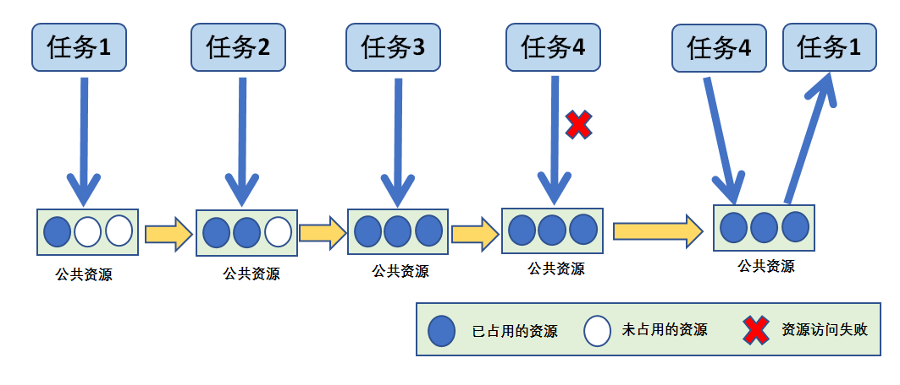

从该图片中可以清晰解读计数信号量（Counting Semaphore）的核心机制。以下结合图中的元素逐步解析其运作原理：

---

### 🧩 **图解计数信号量机制**
#### ▶️ **关键元素说明**
| **图示元素**         | **含义**                              |
|----------------------|---------------------------------------|
| **任务1~4**          | 需要访问共享资源的多个任务（并行）     |
| **“公共资源”模块**    | 被保护的有限资源（如缓冲区、连接池）   |
| **蓝色格子**         | 已占用的资源（当前资源不可用）        |
| **白色格子**         | 未占用的资源（当前资源可用）          |
| **红色叉号**         | 任务访问失败（资源不足，需等待）      |

---

### 🔄 **运作流程（结合图片时序）**
1. **初始状态**  
   - 公共资源池包含多个空闲资源（图中白色格子）。

2. **任务1~3依次请求资源**  
   - 任务1、2、3依次调用 `OSSemPend()` 请求信号量：  
     → **每成功一次，信号量计数器减1**（蓝色格子+1，白色格子-1）。  
   - **结果**：所有资源均被占用（全蓝），信号量值降为0。

3. **任务4请求资源（关键失败场景）**  
   - 任务4调用 `OSSemPend()` 时：  
     → 信号量计数器=0（无空闲资源）→ **访问失败（触发红叉）**。  
   - **任务4行为**：  
     - 若未设置超时，则**等待**（进入阻塞状态）；  
     - 若设置超时，则启动倒计时（超时后强制唤醒）。

4. **任务1释放资源**  
   - 任务1完成操作后调用 `OSSemPost()`：  
     → **信号量计数器加1**（蓝格变白，资源可用）。

5. **任务4成功获取资源**  
   - 资源释放后唤醒等待队列中**优先级最高**的任务（此处为任务4）：  
     → 任务4成功获取资源，信号量计数器再减1（白格变蓝）。

---

### ⚙️ **核心规则总结**
| **操作**               | **信号量变化** | **任务行为**                     | **图示对应**               |
|------------------------|----------------|----------------------------------|----------------------------|
| **任务请求资源（Pend）**| 计数器`-1`     | 资源充足→立即占用；不足→挂起/失败 | 任务4红叉（资源不足）      |
| **任务释放资源（Post）**| 计数器`+1`     | 唤醒等待队列中的最高优先级任务    | 任务1释放后任务4占用成功 |

---

### ⚡ **开发者注意事项**
1. **资源溢出风险**  
   - 如果任务释放次数 > 请求次数，会导致信号量值超过初始值（如初始资源为3，却释放4次），引发逻辑错误。
   - **解决**：严格匹配 `Pend/Post` 调用次数。

2. **优先级与唤醒策略**  
   - 图中虽未直接展示任务优先级，但实际唤醒顺序默认基于优先级（可通过 `OS_OPT_POST_ALL` 唤醒所有任务）。

3. **中断同步场景**  
   - 图中未体现中断（ISR），但在实际项目中：  
     → **ISR只能调用 `OSSemPost()`**（不可等待），释放信号量通知任务处理异步事件（如数据到达）。

---

### 💎 **结论**
您的图片完美诠释了计数信号量如何通过**原子计数器**管理多任务对有限资源的访问：  
- ✅ **资源充足时**：任务直接获取资源（如任务1~3）；  
- ❌ **资源耗尽时**：新任务被迫等待（如任务4）；  
- 🔁 **资源释放后**：操作系统自动唤醒队列首任务（遵循优先级）。  
这一机制是构建稳定多任务系统的核心基础设施之一，尤其适用于连接池、内存池等需量化管理的场景。