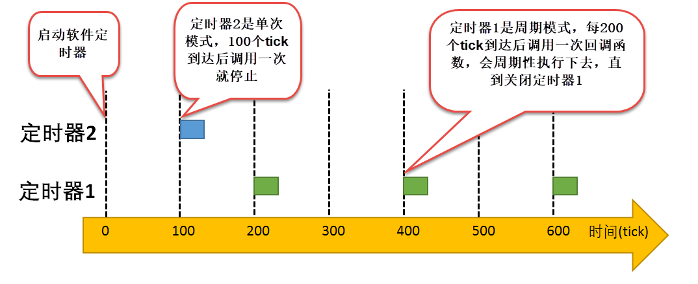

在uCOS-III中，软件定时器的触发模式分为**单次定时器（One-Shot）** 和**周期定时器（Periodic）**，两者通过创建时的`opt`参数（`OS_OPT_TMR_ONE_SHOT`或`OS_OPT_TMR_PERIODIC`）区分，核心区别在于超时后的行为逻辑和适用场景。以下是详细解析：

---

### ⏱️ **一、单次定时器（One-Shot）**
1. **触发机制**  
   - **一次性触发**：定时器从设定的初始延时（`dly`）开始递减计数，超时后仅执行一次回调函数，随后进入**完成态**并停止计数。  
   - **重启需手动**：若需再次触发，必须显式调用`OSTmrStart()`重新启动。

2. **状态迁移**  
   - **运行态 → 完成态**：超时后自动切换为完成态，需手动重启才能再次运行。

3. **典型应用场景**  
   - **超时检测**：如等待串口响应，若30ms未收到数据则判定超时并执行错误处理。  
   - **延迟执行**：系统启动后延迟200ms初始化外设，避免电源波动影响。

4. **代码示例**  
   ```c
   // 创建单次定时器（延时2000ms）
   OSTmrCreate(&tmr2, "Oneshot", 200, 0, OS_OPT_TMR_ONE_SHOT, Callback, NULL, &err);
   OSTmrStart(&tmr2, &err);  // 启动后仅触发一次
   ```

---

### 🔁 **二、周期定时器（Periodic）**
1. **触发机制**  
   - **循环触发**：超时后自动重置计数器（不进入完成态），按周期（`period`）重复执行回调函数。  
   - **初始延时（`dly`）的作用**：  
     - **无初始延时**：`dly=0`时，首次周期直接按`period`计时。  
     - **有初始延时**：`dly>0`时，首次周期为`dly`，后续周期为`period`。  
     *示例*：若`dly=150ms`、`period=100ms`，首次触发需150ms，后续每100ms触发一次。

2. **状态迁移**  
   - **运行态 → 运行态**：超时后自动重置计数器，保持运行态。

3. **典型应用场景**  
   - **周期性任务**：每100ms采集传感器数据。  
   - **心跳检测**：每1s发送设备状态报文。

4. **代码示例**  
   ```c
   // 创建周期定时器（首次延时200ms，后续周期1000ms）
   OSTmrCreate(&tmr1, "Periodic", 20, 100, OS_OPT_TMR_PERIODIC, Callback, NULL, &err);
   OSTmrStart(&tmr1, &err);  // 自动循环触发
   ```

---

### 案例



#### **1. 定时器2（单次模式）**
- **触发时机**：仅在 **100 tick** 时触发一次（图中蓝色矩形）  
- **行为特点**：  
  → 触发后立即进入**完成态**，状态条消失（不再继续运行）  
  → 需调用`OSTmrStart()`才能重启  
- **对应场景**：  
  > *例如：按键消抖——按下后计时50ms，时间到则判定有效按键，随后停止计时。*

#### **2. 定时器1（周期模式）**
- **触发时机**：在 **200、400、600 tick** 周期性触发（图中绿色矩形）  
- **行为特点**：  
  → 首次触发后**自动重置计数器**（状态条持续存在）  
  → 按固定间隔（200 tick）无限循环触发  
- **对应场景**：  
  > *例如：传感器采集——每100ms读取一次温度数据，永不停止直至系统关闭。*

---

| **特性**         | **定时器2（单次）**                          | **定时器1（周期）**                          |
|------------------|---------------------------------------------|---------------------------------------------|
| **触发次数**     | 仅1次（100 tick）                           | 无限次（200→400→600 tick...）               |
| **后续行为**     | 停止运行（状态条消失）                      | 自动重置，持续运行                           |
| **重启条件**     | 需手动调用`OSTmrStart()`                    | 无需干预                                    |
| **内存占用**     | 触发后释放计数资源                          | 长期占用计数资源                            |

---

#### ⚠️ **注意&提醒**
1. **初始延时 vs 周期**  
   - 定时器1首次触发在**200 tick**（非0时刻），说明创建时设置了初始延时（`dly=200 tick`）  
   - 后续触发间隔严格为**200 tick**（`period=200 tick`）

2. **时间精度依赖**  
   - 触发点严格对齐tick刻度（如200/400/600），证明其**精度受系统节拍限制**  （软件定时器的精度（分辨率）决定于系统时基频率，也就是变量OS_CFG_TMR_TASK_RATE_HZ的值，单位是 Hz，软件定时器所定时的数值必须是这个值的整数倍）
   - *若需更高精度（如μs级），需配合硬件定时器使用*

3. **回调函数执行时机**  
   - 触发点（蓝色/绿色矩形）即**回调函数被调用的时刻**  
   - *回调函数必须短小！若执行时间过长会阻塞其他定时器触发*

---

### ⚖️ **三、两种模式的对比与选择建议**
| **特性**         | **单次定时器**                | **周期定时器**                |
|------------------|------------------------------|-------------------------------|
| **触发次数**     | 仅一次                        | 无限循环                      |
| **重启方式**     | 手动调用`OSTmrStart()`        | 自动重置                      |
| **适用场景**     | 超时检测、延迟任务            | 周期性任务（数据采集、心跳包）|
| **资源占用**     | 超时后释放计数资源            | 持续占用计数资源              |
| **状态迁移**     | 运行态 → 完成态               | 运行态 → 运行态               |

**选择建议**：  
- 需**重复执行**的任务（如LED闪烁、数据上报）→ **周期定时器**。  
- **一次性事件**（如按键去抖、通信超时）→ **单次定时器**。

---

### ⚠️ **四、使用注意事项**
1. **回调函数设计**  
   - **禁止阻塞操作**：回调函数中不可调用`OSTimeDly()`等阻塞函数，否则会阻塞定时器任务（优先级通常较低）。  
   - **快速执行**：建议仅执行标志位设置、信号量释放等轻量操作。

2. **定时精度限制**  
   - 依赖系统节拍（如1ms/节拍），实际精度受`OS_CFG_TMR_TASK_RATE_HZ`（如10Hz=100ms）限制，高精度场景需结合硬件定时器。

3. **资源管理**  
   - **单次定时器**：超时后若不删除或重启，会持续占用内存。  
   - **周期定时器**：长期运行需注意任务堆栈溢出风险。

---

### 💎 **总结**  
单次定时器与周期定时器是uCOS-III管理定时任务的两种核心模式，通过`OSTmrCreate()`的`opt`参数区分。**单次模式**适合一次性事件，需手动重启；**周期模式**自动循环触发，适合重复任务。使用时需注意回调函数的简洁性、定时精度限制及资源释放，避免影响系统实时性。