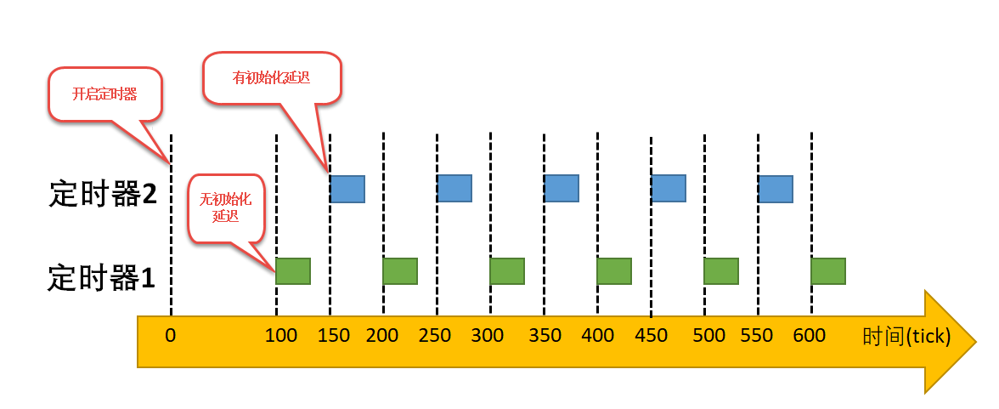
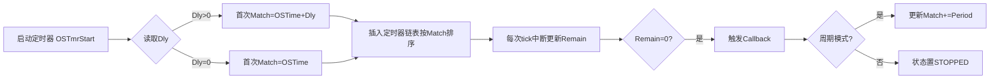

uCOS的软件定时器也属于内核对象，同样在系统中由一个控制块管理其相关信息，软件定时器的控制块中包含创建的软件定时器基本信息，在使用定时器前我们需要通过OSTmrCreate()函数创建一个软件定时器，但是在创建前需要我们定义一个定时器的句柄（控制块）。

### 📊 **软件定时器控制块（os_tmr）解析**
```c
struct os_tmr {
    OS_OBJ_TYPE          Type;          // (1) 内核对象类型标识符
    CPU_CHAR            *NamePtr;       // (2) 定时器名称字符串指针
    OS_TMR_CALLBACK_PTR  CallbackPtr;   // (3) 定时器回调函数指针
    void                *CallbackPtrArg; // (4) 回调函数参数指针
    OS_TMR              *NextPtr;        // (5) 定时器链表后向指针
    OS_TMR              *PrevPtr;        // (6) 定时器链表前向指针
    OS_TICK              Match;          // (7) 绝对触发时间点（tick值）
    OS_TICK              Remain;         // (8) 剩余触发时间（动态变化）
    OS_TICK              Dly;            // (9) 初始延迟时长（tick值）
    OS_TICK              Period;         // (10) 周期触发间隔（tick值）
    OS_OPT               Opt;            // (11) 定时器选项（单次/周期）
    OS_STATE             State;          // (12) 定时器当前状态
};
```



---

### 🧩 **逐字段解析（结合上图）**
1. **`Type`**  
   - **作用**：标识内核对象类型（固定为`OS_OBJ_TMR`）  

2. **`NamePtr`**  
   - **作用**：指向定时器命名字符串（如"Timer1"/"Timer2"）  

3. **`CallbackPtr`**  
   - **作用**：超时触发时执行的函数指针  
   - **与上图的关联**​：时间轴上的每个绿色/蓝色触发点（200/400/600等tick）对应回调执行时刻

4. **`CallbackPtrArg`**  
   - **作用**：传递给回调函数的参数（如设备句柄）  

---

5. **`NextPtr` & `PrevPtr`**  
   - **作用**：构成**双向链表**，按`Match`时间排序管理所有定时器  

6. **`Match`**  
   - **作用**：**绝对系统tick值**（非相对时间），表示下一次触发时刻  
   - **计算逻辑**：
     - 首次触发：`Match = OSTime + Dly`
     - 后续触发：`Match = 前次Match + Period`
   - **与上图的关联**：
     ```c
     // 定时器1（无初始延迟）：
     Match0 = 100(启动时间) + 0 = 100 → 首次触发点
     Match1 = 100 + 100 = 200 → 第二次触发点
     
     // 定时器2（有初始延迟）：
     Match0 = 100(启动时间) + 50 = 150 → 首次触发点
     Match1 = 150 + 100 = 250 → 第二次触发点
     ```

---

7. **`Remain`**  
   - **作用**：动态更新的**剩余tick数**（`= Match - OSTime`）  
   - **与上图的关联**​：时间轴上触发点前的空白区域（如150→250间表示剩余时间递减）

8. **`Dly` (关键字段)**  
   - **作用**：**初始延迟时长**，决定首次触发是否偏移  
   - **与上图的关联**：  
     - 定时器1：`Dly = 0` → 100tick立即开始计数（无黄色延迟区）  
     - 定时器2：`Dly = 50` → 100tick启动后需等待50tick（图表中100→150的黄色区域）

9. **`Period`**  
   - **作用**：**周期性触发间隔**（仅周期模式有效）  
   - **与上图的关联**：两个定时器均设`Period=100` → 触发间隔严格100tick（200→300/250→350）

---

10. **`Opt`**  
    - **作用**：定时器模式配置，包含：  
      ```c
      #define OS_OPT_TMR_ONE_SHOT   0u  // 单次模式
      #define OS_OPT_TMR_PERIODIC   1u  // 周期模式
      ```
    - **与上图的关联**：图中均为周期模式（持续触发）

11. **`State`**  
    - **作用**：定时器当前状态，包含：  
      ```c
      #define OS_TMR_STATE_UNUSED   0u  // 未使用
      #define OS_TMR_STATE_STOPPED  1u  // 已停止
      #define OS_TMR_STATE_RUNNING  2u  // 运行中
      ```
    - **与上图的关联**：图中定时器1/2启动后均为`RUNNING`状态（条形图持续存在）

---

### ⚙️ **参数协作关系图解**


> 通过此逻辑，图中定时器2在`OSTime=100`启动时：
> 1. 因`Dly=50` → `Match=100+50=150`
> 2. 到150tick时触发回调 → 因是周期模式 → `Match=150+100=250`

### 💎 **核心结论**
图表中**初始延迟差异**完全由`Dly`字段控制：
- **定时器1（绿色）**：`Dly=0`  
  → 启动后立刻开始周期计数（100tick即首个触发点）  
- **定时器2（蓝色）**：`Dly=50`  
  → 启动后先等待50tick（100→150），再进入100tick周期循环  

而`Period`字段决定后续触发间隔（图中均为100tick），两者协同实现灵活的时间控制。