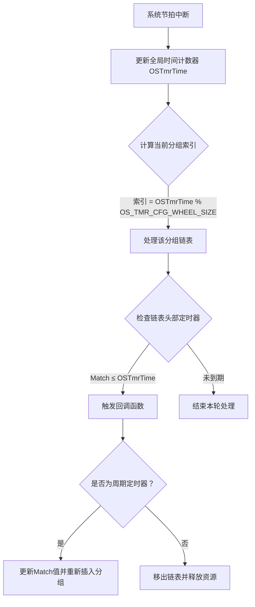

当系统中有多个软件定时器的时候，uCOS可能要维护上百个定时器，该怎么管理呢？

在uCOS-III中，软件定时器列表（Timer List）是**核心管理机制**，用于高效组织、排序和触发系统中所有活动的定时器。其核心作用与实现原理如下：

---

### ⚙️ **一、定时器列表的核心作用**
1. **统一调度管理**  
   所有正在运行的定时器（包括单次和周期模式）均被纳入一个**全局有序列表**，由操作系统内核通过专用任务（如`OS_TmrTask`）统一检测和调度。

2. **按触发时间排序**  
   定时器按**绝对触发时间（Match值）升序排列**，列表头部始终是**最快到期**的定时器。这种设计确保每次系统节拍中断时，只需检查头部定时器是否到期，无需遍历整个列表。

3. **降低CPU开销**  
   采用**时间轮（Timer Wheel）算法**（分组哈希表），将定时器按到期时间分配到不同分组（桶）中。每次节拍中断仅需处理**当前时间片对应分组**的定时器，避免全量扫描。

---

### 🧠 **二、实现机制详解**
#### **1. 数据结构支撑**
- **定时器控制块（OS_TMR）**  
  包含`Match`（绝对触发时刻）、`Remain`（剩余时间）、`NextPtr/PrevPtr`（链表指针）等字段，用于标识定时器状态并链接到列表。  
  ```c
  struct os_tmr {
      OS_TICK    Match;    // 绝对触发时间（tick值）
      OS_TMR    *NextPtr;  // 指向下一定时器的指针
      OS_TMR    *PrevPtr;  // 指向上一定时器的指针
      // ... 其他字段
  };
  ```

- **定时器轮（Timer Wheel）**  
  系统定义哈希表数组`OSTmrWheelTbl[]`，大小由`OS_TMR_CFG_WHEEL_SIZE`配置。定时器按公式分配到对应分组：  
  **分组索引 = Match值 % OS_TMR_CFG_WHEEL_SIZE**  
  同一分组的定时器通过双向链表连接。

#### **2. 工作流程**


---

### ⚠️ **三、关键设计优势**
1. **时间复杂度优化**  
   - **插入/删除操作**：O(1) 复杂度（直接哈希到分组）。  
   - **触发检测**：O(1) 平均复杂度（仅处理单个分组）。

2. **动态分组减少遍历**  
   例如：若`OS_TMR_CFG_WHEEL_SIZE=10`，当前时间片为`105 tick`，则仅处理分组`5 (105%10)`内的定时器，其他分组无需访问。

3. **避免排序开销**  
   定时器插入时按`Match`值排序到链表，但分组机制确保每次只需局部排序，无需全局重排。

---

### 💡 **四、实际应用意义**
1. **支持大规模定时器**  
   理论上可管理**无限数量**的定时器（仅受内存限制），满足物联网设备中大量异步任务需求。  
   *例：传感器网络中数百个设备需独立心跳检测。*

2. **保障实时性**  
   高优先级任务不会被定时器管理阻塞，因为列表操作集中在`OS_TmrTask`（通常设为低优先级）中执行。

3. **资源高效利用**  
   空闲定时器控制块通过`OSTmrFreeList`链表复用，减少内存碎片。

---

### ⚠️ **注意事项**
- **配置参数敏感**：  
  `OS_TMR_CFG_WHEEL_SIZE`需权衡内存与效率，过小会导致分组冲突，过大则浪费内存。
- **回调函数限制**：  
  定时器回调中**禁止调用阻塞API**（如`OSTimeDly()`），否则会卡住整个定时器任务。
- **中断安全**：  
  定时器操作（如启动/停止）**不可在中断服务程序（ISR）中调用**，需通过任务级API。

---

### 💎 **总结**  
软件定时器列表是uCOS-III实现**高效定时器调度**的核心基础设施，通过**时间轮算法+双向链表**，在保证O(1)级操作复杂度的同时，支持海量定时器管理。其设计充分权衡了实时性、资源开销与扩展性，是嵌入式系统中替代硬件定时器的关键方案。