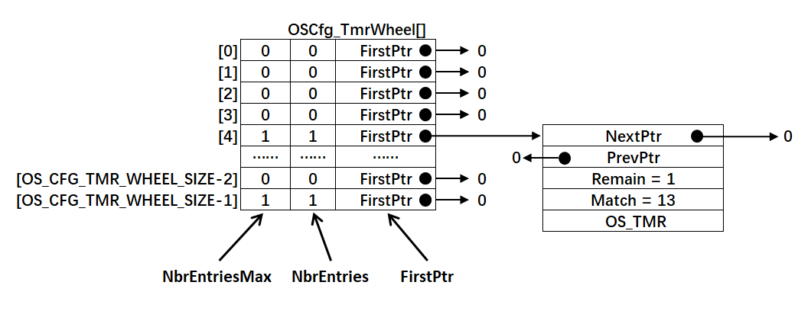
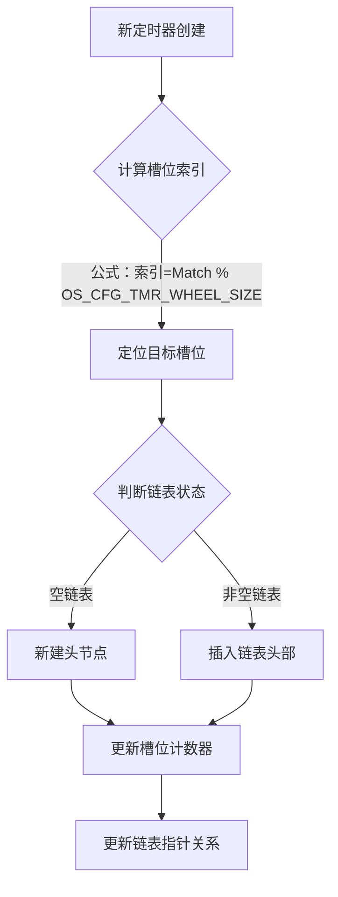

根据您提供的图片信息，我来详细解析uCOS-III定时器轮（Timer Wheel）的结构和工作机制，重点说明定时器列表的组织方式和插入过程：

---

### 🛠️ **一、定时器轮（Timer Wheel）结构解析**
#### **基础结构示意图**
```c
OSCfg_TmrWheel[OS_CFG_TMR_WHEEL_SIZE]  // 定时器轮数组
│
├── [0] 
│   ├── NbrEntriesMax: 0  // 历史最大节点数
│   ├── NbrEntries:    0  // 当前节点数
│   └── FirstPtr:    NULL // 链表头指针 (图中显示→0)
│
├── [4] 
│   ├── NbrEntriesMax: 1  // 历史最大节点数
│   ├── NbrEntries:    1  // 当前节点数
│   └── FirstPtr: ───────┐
│                        ↓
│                        OS_TMR  // 定时器节点
│                        ├── PrevPtr:   0
│                        ├── NextPtr:   0
│                        ├── Match:    13  // 绝对触发时间
│                        └── Remain:    1  // 剩余时间
│
└── [OS_CFG_TMR_WHEEL_SIZE-1]
    ├── NbrEntriesMax: 1  
    ├── NbrEntries:    1  
    └── FirstPtr:    NULL  // 图中显示→0（应为箭头指向节点）
```

#### **核心组成元素**
1. **哈希数组（OSCfg_TmrWheel）**  
   - **尺寸**：由`OS_CFG_TMR_WHEEL_SIZE`定义（图中显示至少5个槽位）
   - **索引规则**：每个槽位对应一组定时器（时间片桶）

2. **槽位控制块**
   - **NbrEntriesMax**：该槽位历史最大节点数（用于性能监控）
   - **NbrEntries**：该槽位当前节点数（动态计数）
   - **FirstPtr**：指向该槽位链表的首节点（双向链表头）

3. **定时器节点（OS_TMR）**
   - **PrevPtr**：指向前驱节点（双向连接）
   - **NextPtr**：指向后继节点
   - **Match**：绝对触发时间（tick值）
   - **Remain**：剩余触发时间（动态计算）

---

### 🔄 **二、定时器插入过程详解**
#### **插入流程图解**


#### **分步骤拆解**
1. **计算哈希槽位索引**  
   当创建定时器时（如`Match=13`）：  
   ```c
   index = Match % OS_CFG_TMR_WHEEL_SIZE;  // 若大小为9，则13%10=4
   ```

2. **定位目标槽位**  
   系统访问数组元素：`OSCfg_TmrWheel[index]`

3. **插入链表（关键操作）**  
   - **场景1：空链表**（如图中槽位3）  
     → 直接作为头节点：`FirstPtr = new_timer`  
     → 设置`PrevPtr/NextPtr=NULL`  
   - **场景2：非空链表**（如图中槽位4）  
     ```c
     new_timer→NextPtr = old_head;  // 新节点指向原头节点
     old_head→PrevPtr = new_timer;  // 原头节点回指新节点
     FirstPtr = new_timer;           // 槽位指针更新为新头节点
     ```

4. **更新计数与指针**  
   - `NbrEntries++`（当前节点数+1）
   - 若`NbrEntries > NbrEntriesMax`，则更新最大值
   - 维护链表双向指针完整性

---

### 🌰 **三、案例解析（图中槽位4）**
#### **插入前状态**
```c
OSCfg_TmrWheel[4]:
  NbrEntries: 0
  FirstPtr: NULL
```

#### **插入Match=13的定时器**
1. 计算索引：`13 % 9 = 4`
2. 链表操作：
   ```c
   new_node→PrevPtr = NULL;   // 头节点无前驱
   new_node→NextPtr = NULL;   // 暂无双后继
   OSCfg_TmrWheel[4].FirstPtr = new_node;  // 指向新节点
   ```
3. 更新计数：
   ```c
   OSCfg_TmrWheel[4].NbrEntries = 1;
   OSCfg_TmrWheel[4].NbrEntriesMax = 1;  // 首次达到
   ```

#### **形成结构**
```c
[4] → OS_TMR {
    PrevPtr: 0,
    NextPtr: 0,
    Match: 13,
    Remain: 1      // 剩余时间动态计算
}
```

---

### 💎 **总结**  
uCOS-III通过**定时器轮+双向链表**实现高效定时器管理：  
✅ **列表结构**：哈希数组分桶 + 槽位计数器 + 有序双向链表  
✅ **插入过程**：哈希定位→头插法→更新计数指针  
✅ **核心价值**：以O(1)复杂度实现海量定时器管理，完美平衡实时性和资源效率  
