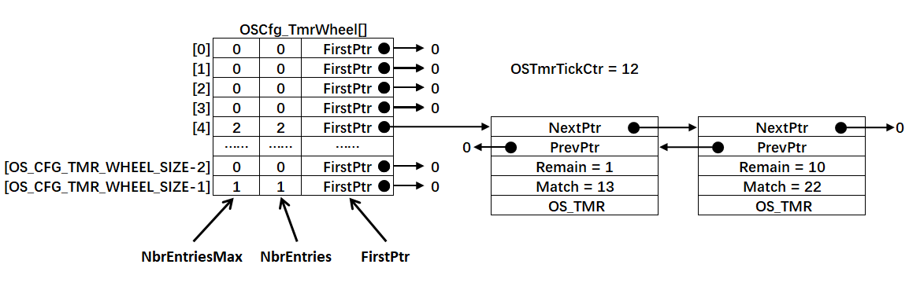

如果系统此时再插入一个周期Period为10的定时器定时器，那么定时器的唤醒时间Match为22（Match = Period + OSTmrTickCtr）。下面来解析步骤：

---

### 📊 **1. 插入前的列表状态**
```c
// 全局变量
OSTmrTickCtr = 12  // 当前滴答计数器

// 定时器轮数组（OS_CFG_TMR_WHEEL_SIZE=9）
OSCfg_TmrWheel[5] = {
    [0]: { NbrEntriesMax=0, NbrEntries=0, FirstPtr=NULL },
    [1]: { ... }, 
    [2]: { ... },
    [3]: { NbrEntriesMax=0, NbrEntries=0, FirstPtr=NULL },
    [4]: { 
        NbrEntriesMax=2, 
        NbrEntries=2,
        FirstPtr → OS_TMR_A  // 指向第一个节点
    }
};

// 槽位4的链表结构 (按Match升序)
OS_TMR_A: { 
    PrevPtr = 0,            // 头节点无前驱
    NextPtr → OS_TMR_B,     // 指向下一个节点
    Remain = 1,             // 还剩下 13-12=1 tick
    Match = 13              // 下次触发时间
}

```

---

### ⚙️ **2. 新定时器插入流程（Match=22）**
#### **步骤1：计算目标槽位索引**
使用哈希算法定位插入位置：  
`index = Match % OS_CFG_TMR_WHEEL_SIZE`  
`index = 22 % 9 = 4`

> ✅ 结论：新定时器应插入**槽位4**

#### **步骤2：创建新定时器节点**
```c
OS_TMR_B: {
    PrevPtr → OS_TMR_A,     // 指向前节点
    NextPtr = 0,            // 尾节点无后继
    Remain = 10,            // 22-12=10
    Match = 22
}
```

#### **步骤3：槽位链表操作**
槽位4不是空链表：
```c
// 往链表尾部插入新节点 OS_TMR_B:
// 更新统计值
OSCfg_TmrWheel[4].NbrEntries = 2;        // 计数从1→2
OSCfg_TmrWheel[4].NbrEntriesMax = 2;      // 更新历史最大值
```

### 💎 **总结**
插入定时器步骤：
1️⃣ **哈希定位**：Match % OS_CFG_TMR_WHEEL_SIZE = X → 目标槽位X  
2️⃣ **空槽插入**：链表节点插入  
3️⃣ **更新统计**：NbrEntries/Max  
4️⃣ **调度就绪**：当滴答增至Match时自动触发  

