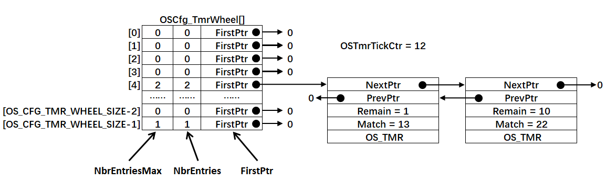
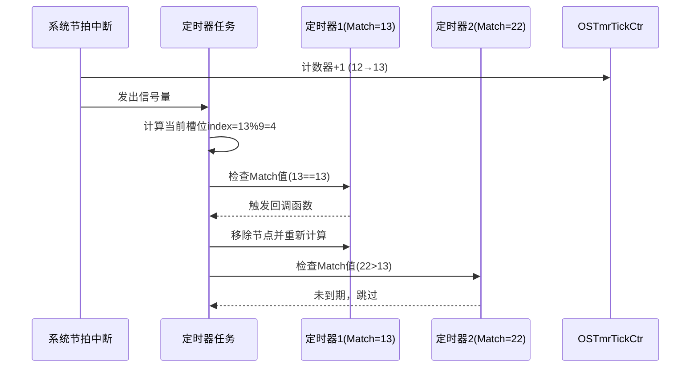

根据您提供的图片信息（OS_CFG_TMR_WHEEL_SIZE=9，OSTmrTickCtr=12），下面详细解析两个定时器在uCOS-III时间轮系统中的触发机制：

---

### ⏱️ **定时器触发核心机制**
**触发条件公式**：`Match == OSTmrTickCtr`  
当系统节拍计数器`OSTmrTickCtr`的值等于定时器的`Match`值时，定时器触发

**具体流程**：


---

### 🔍 **分步骤详解（基于图中OS_CFG_TMR_WHEEL_SIZE=9）**
#### 1. **系统节拍中断（每1ms）**
   - `OSTmrTickCtr`从12增加到13
   - 内核向定时器任务发送信号量

#### 2. **定时器任务唤醒**
   - 计算当前需检测的槽位索引：  
     `index = OSTmrTickCtr % OS_CFG_TMR_WHEEL_SIZE = 13 % 9 = 4`
   - 扫描槽位4的链表（图中包含两个节点）

#### 3. **定时器1（Match=13）处理**
   | 字段        | 值     | 说明                  |
   |-------------|--------|-----------------------|
   | Match       | 13     | 等于OSTmrTickCtr(=13)  |
   | Remain      | 1→0    | 剩余时间归零          |
   | **触发动作** |        |                       |
   - ✅ **立即触发**：Remain=0，于是执行绑定的回调函数
   - 🔁 **周期模式处理**：  
     若该定时器为周期定时器，则更新`Match = 13 + Period`（假设Period=100 → 新Match=113）
   - 📌 **重新插入**：  
     新槽位索引`113%9=5` → 插入槽位5链表（保持升序）

#### 4. **定时器2（Match=22）处理**
   | 字段        | 值     | 说明                   |
   |-------------|--------|------------------------|
   | Match       | 22     | 大于OSTmrTickCtr(=13)   |
   | Remain      | 10→9   | 剩余时间减1            |
   | **状态**    |        |                        |
   - ❌ **不触发**：未达到触发条件
   - 🔄 **位置不变**：保留在槽位4链表中

#### 5. **链表更新后状态**
```c
// 槽位4更新后
OSCfg_TmrWheel[4]:
    NbrEntries: 1        // 从2变为1
    FirstPtr → OS_TMR_B  // 仅剩定时器2
    
OS_TMR_B:
    Match: 22
    Remain: 9           // 22-13=9
```

---

### ⚙️ **时间轮算法的数学原理**
当`OS_CFG_TMR_WHEEL_SIZE=9`时，哈希分布满足：
```math
Index = Match \mod 9
```
**触发窗口计算**：  
定时器将在`OSTmrTickCtr ∈ [N*9+4, (N+1)*9+3]`区间内被检测  
*(N为任意整数，当前触发点在4号槽位)*

**为何高效**：
- 每次只处理1/9的定时器（约11.1%）
- 检测时间复杂度为O(1)（仅扫描单槽链表）

---

### 🌰 **完整触发周期示例**
| OSTmrTickCtr | 检测槽位 | 触发条件                    |
|-------------|----------|----------------------------|
| 12          | 3 (12%9) | 槽位3的所有Match≤12的定时器  |
| 13     | **4**    | **定时器1触发**             |
| 14          | 5        | 槽位5的Match≤14定时器       |
| ...         | ...      | ...                        |
| 22          | 4 (22%9) | 定时器2触发                 |

> 定时器2将在`OSTmrTickCtr=22`时由槽位4的扫描触发

---

### ⚠️ **关键注意事项**
1. **精度依赖**  
   最小时间分辨率为1个节拍（通常1-10ms），无法处理us级定时

2. **周期定时器重置**  
   重新插入时计算：  
   `新Match = 原Match + Period`  
   `新槽位 = 新Match % OS_CFG_TMR_WHEEL_SIZE`

3. **链表排序规则**  
   槽位内链表按Match升序排列，确保最近触发的定时器优先处理

4. **中断延迟影响**  
   若定时器任务被阻塞，触发可能延迟但不会丢失（Match≤OSTmrTickCtr即触发）

---

### 💎 **总结**
在uCOS-III时间轮系统中（OS_CFG_TMR_WHEEL_SIZE=9）：
✅ **触发时机**：`OSTmrTickCtr == Match`时精确触发  
✅ **检测机制**：每次节拍中断检测单个槽位（index=当前tick%9）  
✅ **处理流程**：  
   1. 触发到期定时器回调  
   2. 周期定时器更新Match并重新哈希  
   3. 更新链表和剩余时间  
✅ **设计优势**：O(1)检测复杂度，完美支持大规模定时器管理  

> 图中定时器1在tick=13时从槽位4触发，定时器2将在tick=22时触发，时间轮机制确保定时事件精确执行。