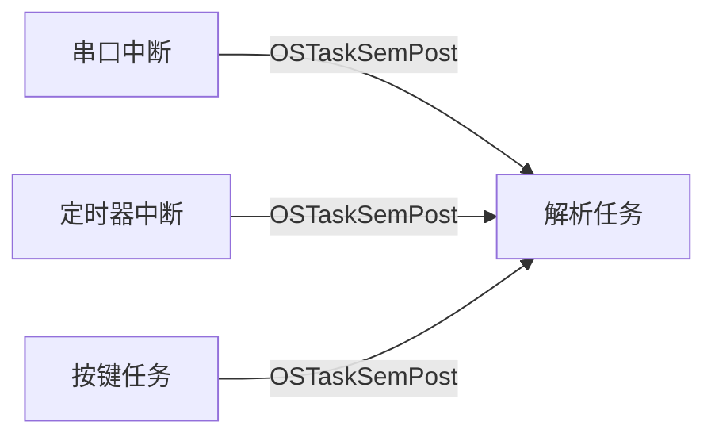

 **任务信号量的本质是“多对一”的单向通信机制**：  
**多个发送者（任务/中断）→ 仅一个接收者（固定任务）**，且**无法实现一对多广播**。以下是具体分析：

---

### ⚠️ **为什么任务信号量无法“一对多”？**
#### 1. **物理限制：信号量绑定唯一任务**
   - 任务信号量是 **任务控制块（TCB）的内置计数器**（如 `TaskTCB.SemCtr`）。
   - 发送时必须指定目标任务（`OSTaskSemPost(&TaskTCB)`），信号量仅该任务的TCB能响应。
   - **无法同时唤醒多个任务**：没有全局队列或等待列表支持多任务监听同一信号量。

#### 2. **与内核信号量的关键差异**
   | **特性**         | 任务信号量                     | 内核信号量                  |
   |------------------|-------------------------------|---------------------------|
   | **接收者数量**   | 仅一个固定任务                | 多个任务可同时等待          |
   | **广播能力**     | ❌ 不支持                      | ✅ 支持（`OS_OPT_POST_ALL`） |
   | **数据传递**     | ❌ 仅计数，无数据              | ✅ 可携带消息（如消息队列）   |

---

### 🛠️ **如何实现“一对多”通知？**
#### ✅ **强制使用内核信号量！**
若需一个事件触发多个任务，**必须用内核信号量**（或消息队列）：
```c
// 创建全局内核信号量
OS_SEM  GlobalSem;
OSSemCreate(&GlobalSem, "GlobalSem", 0, &err);

// 发送端（如中断中）：唤醒所有等待任务
OSSemPost(&GlobalSem, OS_OPT_POST_ALL, &err);  // OS_OPT_POST_ALL是关键！

// 接收端：多个任务可同时等待
void Task1(void *p_arg) {
    while (1) {
        OSSemPend(&GlobalSem, 0, OS_OPT_PEND_BLOCKING, ...);
        // 任务1被唤醒...
    }
}
void Task2(void *p_arg) {
    while (1) {
        OSSemPend(&GlobalSem, 0, OS_OPT_PEND_BLOCKING, ...);
        // 任务2被唤醒...
    }
}
```

---

### ⚡️ **任务信号量的适用场景（强调“多对一”）**
适合以下模式：  
**多个事件源 → 单个任务**  

- **实际应用**：
  - 多个传感器数据到达 → 统一处理任务
  - 多个外设中断（UART、ADC）→ 同一个数据处理任务

---

### ❌ **错误尝试：强制“一对多”会怎样？**
若试图用任务信号量模拟广播（如循环调用 `OSTaskSemPost()` 给多个任务）：
```c
// 错误示例！
OSTaskSemPost(&TaskTCB1);  // 发送给任务1
OSTaskSemPost(&TaskTCB2);  // 发送给任务2
```
**问题**：
1. **非原子操作**：两次发送间可能被中断，导致任务唤醒时间偏移。
2. **性能损失**：逐个发送效率远低于内核信号量的单次广播。
3. **资源浪费**：频繁操作多个TCB计数器的开销高于单次内核对象访问。

---

### 💎 **结论**
| **需求**              | **推荐方案**       | **原因**                             |
|-----------------------|--------------------|-------------------------------------|
| **多对一**            | ✅ 任务信号量        | 高效定点通知，零额外资源占用          |
| **一对多广播**        | ✅ **内核信号量**    | 单次调用可唤醒所有等待任务            |
| **多对多**            | ✅ 内核信号量/队列   | 全局对象支持复杂同步                  |

> **简单记忆**：  
> **任务信号量是“专属呼叫铃”（只响一个工位），内核信号量是“办公室广播”（全员听到）**。若需全员通知，后者是唯一选择！