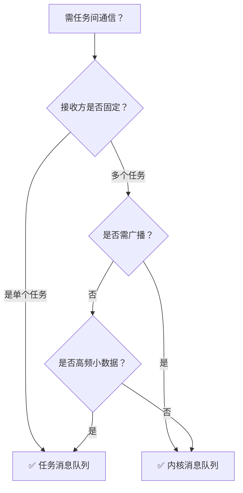

在实时操作系统（如uCOS-III、LiteOS等）中，**任务消息队列**和**内核消息队列**是两种不同的通信机制，核心区别在于**所有权、通信模式、资源开销及适用场景**。以下是详细对比：

---

### ⚙️ 一、本质与所有权
| **类型**         | **任务消息队列**                          | **内核消息队列**                          |
|------------------|------------------------------------------|------------------------------------------|
| **所有权**       | 内嵌于任务控制块（TCB），**任务私有**  | 独立内核对象，**全局共享**          |
| **创建方式**     | 随任务创建自动生成，**无需显式创建**    | 需调用API（如`OSQCreate()`）**显式创建**  |
| **生命周期**     | 与任务绑定，任务删除则队列消失            | 独立存在，需手动删除                |

---

### 🔄 二、通信模式与灵活性
| **特性**         | **任务消息队列**                          | **内核消息队列**                          |
|------------------|------------------------------------------|------------------------------------------|
| **通信方向**     | **单向点对点**：仅能由其他任务/中断向**指定任务**发送  | **多对多**：任意任务可发送/接收，支持广播  |
| **接收者范围**   | 仅绑定任务可接收                      | 多个任务可同时等待同一队列          |
| **消息存储策略** | 支持FIFO/LIFO                     | 支持FIFO/LIFO/优先级排序               |

---

### ⚡️ 三、性能与资源开销
| **维度**         | **任务消息队列**                          | **内核消息队列**                          |
|------------------|------------------------------------------|------------------------------------------|
| **访问效率**     | **更高**：直接操作TCB计数器，无全局对象查找  | **较低**：需内核对象查表和锁机制    |
| **内存占用**     | **零额外开销**（复用TCB空间）          | 需独立内存存储队列结构            |
| **中断适用性**   | **更优**：中断中发送无需复杂同步    | 可用但需注意上下文限制            |

---

### 🎯 四、适用场景对比
| **场景**                     | **推荐机制**       | **原因说明**                                                                 |
|------------------------------|-------------------|----------------------------------------------------------------------------|
| **中断通知特定任务**         | ✅ 任务消息队列     | 高效定向通知，避免全局竞争（如串口数据触发解析任务）                 |
| **多任务共享同一事件**       | ✅ 内核消息队列     | 支持广播唤醒（如资源就绪时通知所有等待任务）                        |
| **高频小数据传递**           | ✅ 任务消息队列     | 低延迟、无锁设计（如传感器数据实时传递）                            |
| **大型数据或复杂消息**       | ✅ 内核消息队列     | 可传递不定长数据，支持缓冲（如文件分块传输）                        |
| **需严格优先级处理的消息**   | ✅ 内核消息队列     | 支持按任务优先级排序消息（如紧急事件优先响应）                          |

---

### 💡 五、关键差异总结
1. **私有性 vs 全局性**  
   任务队列是任务的“专属邮箱”，仅限所有者读取；内核队列是“公共公告板”，多方可读写 。
2. **性能取舍**  
   任务队列牺牲灵活性换取速度和低开销，适合高频定向通信；内核队列功能全面但开销较大 。
3. **设计哲学**  
   任务队列实现 **“消息直达”**，减少中间层；内核队列提供 **“集中式路由”**，支持复杂交互 。

---

### 🛠️ 六、决策树：如何选择？

> **经验法则**：  
> - **“专属事件，用任务队列”**（如按键触发任务）  
> - **“公共资源，用内核队列”**（如多个任务等待SD卡就绪）