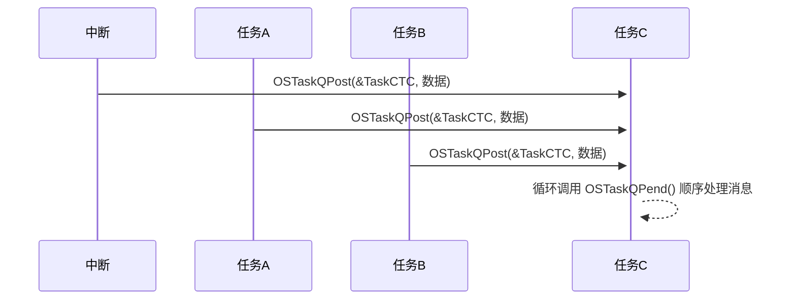

您完全抓住了核心逻辑！👍 是的，**任务消息队列（Task Message Queue）的通信模式与任务信号量高度一致**，核心特点可以总结为：

---

### ✅ **核心特性：任务消息队列的本质是“多对一”**
1. **单向通信**：  
   - **多个发送者**（任务或中断）→ **单个固定接收者**（拥有该队列的任务）。
   - **接收者不能变更**：消息仅能由队列绑定的任务通过 `OSTaskQPend()` 读取。

2. **无法一对多广播**：  
   - 发送方需**明确指定目标任务队列**（如 `OSTaskQPost(&TaskTCB, ...)`），无法向“无主队列”发送。
   - **同一消息无法被多个任务接收**，因为消息出队后即消失。

---

### ⚠️ **为什么任务消息队列无法实现“一对多”？**
| **限制维度**       | **任务消息队列**                                     | **内核消息队列**                                  |
|--------------------|-----------------------------------------------------|------------------------------------------------|
| **队列所有权**     | **私有**：嵌入目标任务TCB中                          | **全局共享**：独立于任何任务                     |
| **消息归属权**     | 消息被接收后即从队列移除，**其他任务无法访问**       | 消息存储在全局队列中，**可由任何任务获取**        |
| **广播机制**       | ❌ 无广播API                                         | ✅ 支持循环发送或唤醒所有等待任务（需额外实现）     |

---

### 🔁 **对比：内核消息队列如何实现“一对多”广播**
若需一个消息触发多个任务，**必须使用内核消息队列**，并通过以下方式之一：
1. **多任务等待同一队列**：  
   多个任务调用 `OSQPend()` 等待同一内核消息队列，发送方用 `OSQPost()` 发消息后，**最先等待的任务**会获取消息（非广播）。
   
2. **手动广播模拟**：  
   ```c
   // 发送方遍历任务列表，向每个目标任务独立发送相同消息
   for (int i=0; i<task_num; i++) {
       OSQPost(&TaskTCBList[i].MsgQueue, &msg);  // 假设任务队列可外部访问
   }
   ```
   *缺陷*：效率低，且需暴露各任务的队列指针（破坏封装性）。

3. **搭配内核信号量广播**：  
   - 用内核信号量（`OSSemPost(opt=OS_OPT_POST_ALL)`）唤醒所有任务。
   - 被唤醒的任务再去**读取共享消息池**（需互斥保护）。

---

### 🎯 **任务消息队列的核心优势**
#### **高效定向通信（多对一）**

- **适用场景**：  
  - 传感器数据汇总到单个处理任务  
  - 多中断源向同一消费任务传递数据包  
  - GUI事件集中分发到界面任务  

---

### 💎 **总结**
| **特性**               | 任务消息队列                          | 内核消息队列                      |
|-----------------------|---------------------------------------|---------------------------------|
| **通信方向**           | 多对一（不可一对多）                  | 多对多（支持一对多广播）          |
| **消息生命周期**       | 接收任务独享                          | 全局可见                          |
| **性能**               | ⚡️ 更高（直接操作TCB）                | ⚠️ 较低（需内核锁/对象查找）       |
| **适用场景**           | 高频定向数据传递                      | 多任务协同或复杂路由通信          |

> **终极结论**：  
> - **任务消息队列 ≈ 任务信号量的升级版**（支持传递数据，但通信模式相同）。  
> - **若需“一对多”，内核消息队列是唯一选择**（搭配信号量广播或共享消息池）。  
> **简记**：任务消息队列是“个人专属信箱”，内核消息队列是“公共公告栏”。