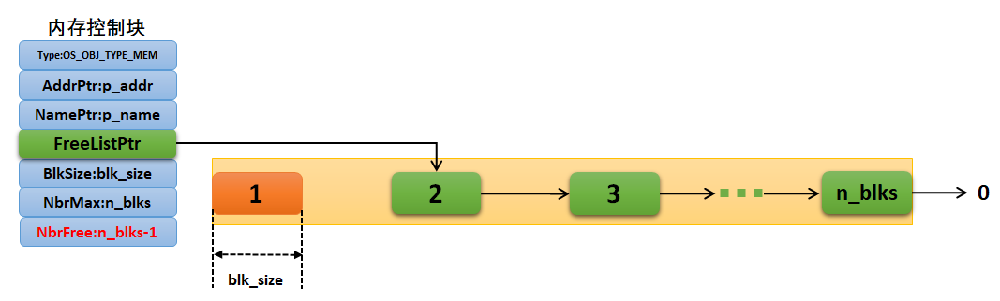

**uC/OS-III内存池的内存申请流程**可通过图中标注的元素清晰解读（图中红色块表示被申请的内存块）。以下是结合图片的详细说明：

---

### **内存申请流程解析**
#### **1. 初始状态**


- **内存控制块**（左侧）:
  - `FreeListPtr` ➔ **指向首个空闲块**（图中块1的地址）。
  - `NbrFree = n_blks`（初始空闲块数量等于总块数）。
- **内存块链表**（右侧）：
  - 所有块（1 到 n_blks）通过**单向链表**连接（每个块首地址存储下一块地址）。
  - 块 **1** 当前处于空闲状态，但后续将被申请。

#### **2. 用户请求内存**



用户调用 `OSMemGet()`，系统执行：
- **步骤①：检查空闲块**  
  - 内核确认 `NbrFree > 0`（`n_blks` > 0 成立，），允许分配。

- **步骤②：定位目标块**  
  - 通过 `FreeListPtr` 找到当前空闲链表头节点 ➔ **块1的地址**。

- **步骤③：分配内存块**  
  - **取出块1**：将块1的地址返回给用户。
  - **更新链表头**：
    - `FreeListPtr` **重定向到块2**（原块1存储的下一块地址）。
    ```c
    // 伪代码：更新空闲链表头指针
    p_mem->FreeListPtr = *(void**)p_block; // p_block是块1的地址
    ```
    > ✅ 图中变化：`FreeListPtr` 箭头从指向块1变为指向块2。

#### **3. 更新控制块状态**

- **空闲块计数器减1**：  
  - `NbrFree` 从 `n_blks` 更新为 `n_blks-1`（图中明确标注）。
- **物理变化**：
  - 块1变为**红色**（表示已被用户占用，不再属于空闲链表）。
  - 空闲链表从 `块1 → 块2 → 块3 → ... → 块n_blks`  
    更新为：`块2 → 块3 → ... → 块n_blks`。

---

### **开发者注意点**
1. **内存分配结果**  
   - 用户获取的内存块（如块1）可**直接使用**，无需额外初始化（但需用户自行擦除旧数据）。
   - 块内地址连续，大小为 `blk_size`。

2. **内存耗尽场景**  
   - 若 `NbrFree = 0`（图中未发生），`OSMemGet()` 返回 `NULL`，错误码为 `OS_ERR_MEM_NO_FREE_BLKS`。

3. **释放内存**  
   - 用户调用 `OSMemPut()` 后：
     - 块1 **重新链接回空闲链表头部**。
     - `FreeListPtr` 指回块1，`NbrFree` 值加1。
