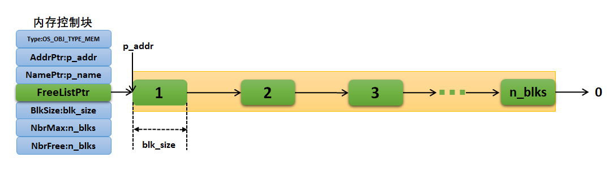

仍然是这个图，如果我要释放块1会发生什么呢？

!()[申请内存.png]

根据图片中的信息和内存池的管理机制，**释放块1（图中橙色块）时发生的变化**可分为以下关键步骤（图中将直观展示控制块与物理内存块的实时更新）：

---

### **释放前的初始状态**（图中当前状态）
- **内存控制块关键值**（左侧）：
  - `FreeListPtr` ➔ 指向 **块2**（绿色箭头指向块2）。
  - `NbrFree = n_blks-1` ➔ **空闲块数比总块数少1**（即块1已被占用）。
- **内存块状态**（右侧）：
  - **块1：橙色**（已被用户占用，**脱离空闲链表**）。
  - **块2~n_blks：绿色**，空闲。
  - 空闲链表结构：**块2 ➔ 块3 ➔ ... ➔ 块n_blks ➔ NULL**（末尾指向0）。

---

### **释放操作流程**（调用 `OSMemPut(&MemPool, p_block)`）
#### **步骤1：定位释放块**
- 用户调用 `OSMemPut()`，传入要释放的块1地址 `p_block = &block1`。

#### **步骤2：插入到空闲链表头部**



- **修改块1的内部指针**（图中未显式绘制，但真实存在）：  
  - 将块1的**首地址位置**存储原空闲链表头地址（即块2的地址）。  
  ```c
  *(void**)p_block = p_mem->FreeListPtr; // 块1的下一个指向块2
  ```
  > ✅ 图中逻辑：**块1→块2→...→块n_blks**。

- **更新 `FreeListPtr`**：  
  - `FreeListPtr` **重定向到块1**（新的链表头）。  
  ```c
  p_mem->FreeListPtr = p_block;          // 控制块指向块1
  ```
  > ✅ 图中变化：左侧控制块的绿色箭头**从指向块2转向块1**。

#### **步骤3：更新计数器**

- **`NbrFree` 加1**：  
  - 值从 `n_blks-1` 变为 `n_blks`（恢复为总块数），表示块1已成功释放。

#### **步骤4：物理状态变更**
- **块1颜色切换**：  
  - 从**橙色（占用）** 变为 **绿色（空闲）**。
- **空闲链表重组**：  
  - 新链表结构：**块1 → 块2 → 块3 → ... → 块n_blks → NULL**。

---

### **开发者注意**
1. **释放的安全性**  
   - 必须确保释放的地址是**从该内存池分配出的有效块**，否则会破坏链表结构（导致系统崩溃）。
2. **内存残留数据**  
   - 释放后内存块内**数据不被擦除**，需用户主动清理敏感信息（如密码、密钥）。
3. **实时性优势**  
   - 无论内存池规模多大，释放操作仅需修改**1个指针和1个计数器**（极端高效）。

> **设计本质**：uC/OS-III 内存池释放机制采用 **“头插法”**，通过牺牲内存块复用顺序的严格性（新释放块优先被分配），换取了 **O(1)** 时间复杂度的确定性性能。图中状态变化直观体现了这一思想。