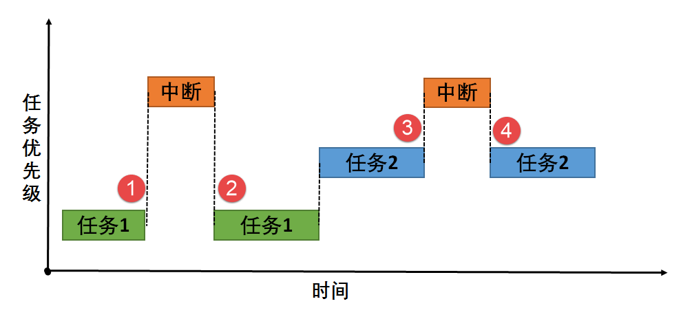

好的，我们参照您提供的图片，来详细说明中断（Interrupt）在计算机系统中的一般运作原理。

图片非常清晰地展示了中断的核心：**一个正在执行的任务被更高优先级的事件（中断）打断，系统先去处理该事件，处理完毕后再恢复原始任务（或根据调度执行新任务）**。

整个过程可以分为以下几个核心步骤：

---

### 1. 正常任务执行 (对应图中标记1和3之前的阶段)

*   系统正在正常执行一个任务（如图中的**任务1**，优先级2）。
*   此时，CPU控制权在该任务手中，程序计数器（PC）指向该任务的下一条指令地址。

### 2. 中断请求 (Interrupt Request, IRQ) - (对应图中任务1和任务2被“中断”箭头打断的瞬间)

*   一个硬件设备（如键盘、鼠标、网络卡、定时器）或软件需要CPU立即处理某个事件，于是它向CPU发出一个**中断请求信号**。
*   **关键点**：中断是**异步**的，意味着它可以在任何时间点发生，与当前正在执行的代码无关。

### 3. 中断响应 (Interrupt Response)

*   CPU在每个指令周期的末尾都会检查是否有中断请求到来。
*   一旦检测到有效的中断请求，CPU并不会立即跳转。它会先完成当前正在执行的指令。
*   然后，CPU会判断当前任务的优先级和中断的优先级。如果**中断的优先级高于当前任务的优先级**（如图中**中断**的优先级为3，高于任务1的优先级2），CPU就会响应这个中断。

### 4. 保存现场 (Context Save) - (对应图中任务1和任务2被暂停的状态)

*   在跳去处理中断之前，CPU必须“记住”当前任务被打断时的状态，以便将来能准确地回来继续执行。
*   CPU会自动将当前的**程序计数器（PC）、状态寄存器（PSW）** 等关键信息压入**堆栈（Stack）** 中保存起来。这个过程通常由硬件直接完成，非常快。
*   此时，当前任务（如任务1）的状态就被“冻结”了，如图中任务1的流程被中断并暂停。

### 5. 执行中断服务程序 (Interrupt Service Routine, ISR) - (对应图中橙色的“中断”块)

*   CPU根据中断请求源，从一个叫做**中断向量表**的预定义内存区域中，找到对应的**中断服务程序（ISR）** 的入口地址。
*   **中断服务程序（ISR）** 是一段专门为处理该中断事件而编写的软件代码（例如，键盘ISR负责读取按键值，网络ISR负责接收数据包）。
*   CPU开始执行ISR中的指令，完成中断所要求的任务。**ISR的设计通常要求尽可能短小精悍**，以避免长时间阻塞其他更重要的任务或中断。

### 6. 恢复现场与返回 (Context Restore & Return) - (对应图中中断结束后，任务1在标记2处恢复)

*   ISR执行到最后一条指令通常是**中断返回指令**（如x86架构的`IRET`）。
*   这条指令会触发CPU从堆栈中弹出之前保存的**程序计数器（PC）和状态寄存器（PSW）** 等信息，这个过程称为“恢复现场”。
*   CPU的寄存器状态恢复到中断发生前的那一刻，程序计数器也指回了原来任务被中断的那条指令。

### 7. 恢复任务执行 (Resume Task Execution)

*   之后，CPU继续从刚才被打断的指令处执行原来的任务（如图中任务1从标记2处恢复），就好像中断从未发生过一样。

---

### 图片中展示的特殊情况：任务调度

您的图片还展示了一个更复杂但也更真实的情况：**中断处理程序并不总是简单地恢复原任务**。

*   在**标记4**之后，中断处理完毕，但系统没有恢复被中断的**任务2**，而是执行了优先级更高的**任务1**（标记2）。
*   这暗示了**中断服务程序可能唤醒了另一个高优先级的任务**。
*   在实际的操作系统中，**中断处理常常分为两部分**：
    1.  **上半部（Top Half）**：在中断上下文中快速执行，负责紧急的工作（如应答硬件、拷贝数据），通常全程禁止中断。
    2.  **下半部（Bottom Half）**：稍后在一个更安全的环境中执行（如由系统调度器调度），完成更耗时的处理。这个“下半部”的执行可能会改变系统的任务调度决策。

### 总结

中断的运作机制可以类比为：

> 你正在写作业（**执行任务1**），突然电话响了（**中断请求**）。你先把书看到哪一页、笔放在哪里记下来（**保存现场**），然后去接电话（**执行ISR**）。通话结束后，你根据刚才的记录回到书桌前，继续从刚才停顿的地方写作业（**恢复现场并返回**）。或者，接电话时对方告诉你有个紧急快递到了，于是你挂掉电话后决定先下楼取快递（**中断导致调度了新任务**），然后再回来写作业。

这种机制极大地提高了CPU的效率，使其不必不断地轮询（Polling）各个设备的状态，而是由设备主动“通知”CPU，从而让CPU在无事可做时可以进入低功耗状态，有事时能立即响应。它是所有现代操作系统实现多任务和实时响应的基石。