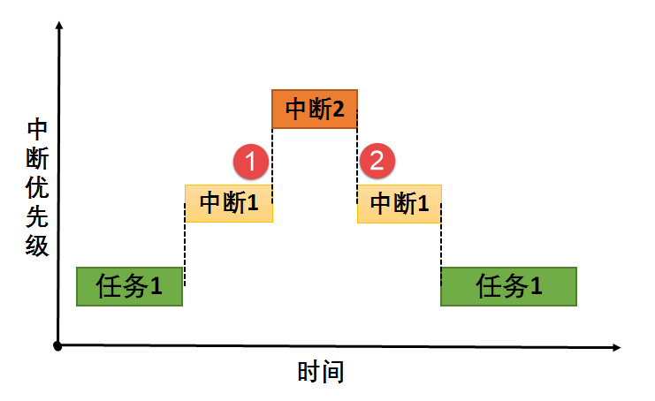

当然可以。您提供的图片非常经典和准确，它清晰地展示了**中断嵌套（Interrupt Nesting）** 的发生过程。下面我将根据此图，详细解释中断嵌套是如何发生的。

### 什么是中断嵌套？

中断嵌套是指：**当一个低优先级的中断服务程序（ISR）正在执行时，一个更高优先级的中断源发出了请求，CPU暂停当前的低优先级ISR，转去执行高优先级的ISR，待高优先级的ISR执行完毕后，再返回继续执行被暂停的低优先级ISR**。

这个过程就像打电话时又一个更紧急的电话打进来，你让第一个电话稍等，先去接那个更紧急的。

---

### 根据图片的分步详解

图中描绘了一个包含两个中断（中断1和中断2）和一个后台任务（任务1）的场景。我们假设优先级关系为：**中断2 > 中断1 > 任务1**。

**初始状态：**
*   CPU正在执行优先级最低的**任务1**（绿色长条）。

**阶段一：中断1发生（对应红色气泡标记1）**
1.  **中断请求（IRQ1）**：某个硬件（如串口接收到数据）发出了“中断1”的请求。
2.  **响应与现场保存**：CPU检测到请求，因其优先级（假设为2）高于当前运行的任务1（优先级3），于是响应中断。
    *   CPU**自动**将任务1的现场（程序计数器PC、状态寄存器PSW等）压入堆栈保存。
3.  **执行ISR1**：CPU通过查询中断向量表，跳转到**中断1的服务程序（ISR1）** 开始执行（黄色长条）。此时，任务1被完全挂起。

**阶段二：中断嵌套发生——更高优先级的中断2发生（对应红色气泡标记2）**
1.  **新的中断请求（IRQ2）**：在ISR1执行期间，一个更高优先级的硬件事件（如硬件定时器溢出）发生了，发出了“中断2”的请求。其优先级（假设为1）高于正在执行的ISR1（优先级2）。
2.  **关键条件**：大多数CPU允许在中断服务程序中**再次响应更高优先级的中断**。这通常需要满足：
    *   **优先级条件**：新中断的硬件优先级高于当前正在处理的中断。
    *   **软件条件**：当前正在执行的ISR1**没有主动禁止中断**（即没有执行像`CLI`这样的关中断指令）。在ISR开头，CPU通常会**自动禁止响应同级和低优先级中断**，但高优先级中断通常仍然可以打入。
3.  **再次响应与现场保存**：CPU响应更高优先级的中断2。
    *   CPU**再次自动**将当前正在执行的ISR1的现场（PC, PSW等）压入堆栈。**注意**：此时堆栈中有了两层数据，最底下是任务1的现场，上面是ISR1的现场。
4.  **执行ISR2**：CPU跳转到**中断2的服务程序（ISR2）** 开始执行（橙色长条）。此时，ISR1也被挂起，任务1同样处于挂起状态。**这就是“嵌套”的核心：一个ISR打断了另一个ISR**。

**阶段三：高优先级中断处理完毕并返回**
1.  **ISR2执行完毕**：更高优先级的ISR2执行到最后一条指令——**中断返回指令（IRET）**。
2.  **恢复现场**：`IRET`指令触发CPU从堆栈中**弹出**之前保存的ISR1的现场信息（PC, PSW）。
3.  **返回**：CPU恢复到ISR1被打断的那一条指令，继续执行**被挂起的ISR1**。

**阶段四：低优先级中断处理完毕并返回**
1.  **ISR1执行完毕**：ISR1也执行到了它的`IRET`指令。
2.  **恢复现场**：这次，`IRET`指令从堆栈中弹出的是最早保存的**任务1**的现场信息。
3.  **返回**：CPU恢复到任务1被打断的那一条指令，继续执行**任务1**。

---

### 总结与关键点

1.  **必要条件**：中断嵌套的发生需要两个核心条件：
    *   **硬件优先级**：后发生的中断必须比当前正在处理的中断**优先级更高**。
    *   **中断开放**：系统（或当前ISR）**没有屏蔽所有中断**。高优先级中断通常默认是可嵌套的。

2.  **现场保存**：关键在于**堆栈（Stack）** 的运用。每一次被中断，当前状态都被压入堆栈；每一次返回，都从堆栈弹出恢复。堆栈的**后进先出（LIFO）** 特性完美匹配了嵌套的顺序（最后发生的中断最先返回）。

3.  **重要性**：中断嵌套机制极大地提高了系统的**实时性**。它确保了对时间要求极其苛刻的事件（如电源故障、紧急报警）能够立即得到响应，即使系统当时正在处理一个重要性稍低的中断。

4.  **风险与控制**：不受控制的深度嵌套会占用大量堆栈空间，可能导致堆栈溢出。因此，在实时操作系统（RTOS）中，会精心设计中断优先级，并且程序员有时需要在ISR内手动控制中断的开关，以管理嵌套行为。

您的这张图完美地捕捉了这一切：**时间线（横轴）**、**优先级（纵轴）**、**任务与中断的执行流**以及**嵌套发生的精确时刻（红色气泡）**，是一张非常优秀的示意图。