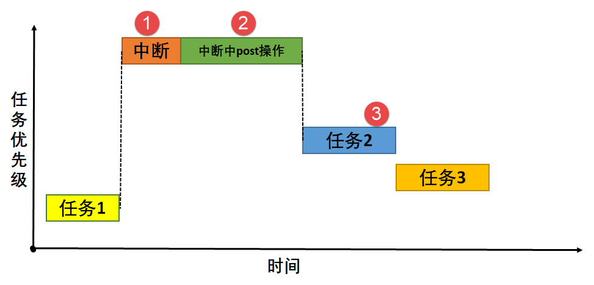

根据这张时序图，我们可以清晰地解读 **uC/OS-III 中的中断直接发布（Direct Post）** 的完整过程。

这张图非常经典，它描绘了中断如何打断当前任务，并在中断服务例程（ISR）中**直接**调用内核服务（如发送信号量、消息等），从而立即唤醒一个高优先级任务的过程。

整个过程可以分为以下四个阶段，与图中的标注完美对应：

---

### 阶段一：低优先级任务运行 (对应图中 `任务1`)

*   **系统状态**：在中断发生前，CPU 正在执行一个低优先级的 **任务1**（优先级为3）。
*   **此时调度器**的任务就绪表中，**任务1** 是优先级最高的就绪任务，因此它拥有CPU的执行权。

---

### 阶段二：中断发生与响应 (对应图中 `中断` 块和标记 ①)

1.  **中断请求**：一个硬件外设（如定时器、串口）发出了中断请求。
2.  **立即响应**：
    *   由于**中断的优先级**（通常为最高，图中可理解为优先级1）远高于当前运行的 **任务1**（优先级3），CPU 立即响应此中断。
    *   CPU 自动保存当前任务（任务1）的上下文（如程序计数器、寄存器值）到其任务堆栈中。
3.  **执行ISR**：CPU 跳转到该中断对应的**中断服务程序（ISR）** 开始执行。至此，**任务1** 被强制挂起，其状态从“运行”变为“就绪”。

---

### 阶段三：中断服务程序中的直接发布 (对应图中 `中断中post操作` 块和标记 ②)

*   **关键操作**：在 ISR 内部，执行了一个 **“Post”操作**。这是一个统称，具体可以是：
    *   `OSSemPost()` 发布一个信号量
    *   `OSQPost()` 发送一个消息到队列
    *   `OSTaskQPost()` 向任务发送一个消息
    *   `OSTimeTick()` 系统节拍服务（也属于一种Post）
*   **直接发布的特性**：
    *   这个调用是**直接**的、**立即**发生的。
    *   在执行这个内核服务函数时，uC/OS-III 会**进入临界区**（通常通过关中断的方式），以保护内核数据结构的完整性。
    *   **Post操作的结果**：该操作使得一个正在等待该信号量/消息的 **任务2** 从“挂起”状态变为“就绪”状态。**任务2** 的优先级（优先级2）高于 **任务1**（优先级3）。

---

### 阶段四：中断退出与任务调度 (对应图中 `任务2` 开始和标记 ③)

1.  **ISR 执行结束**：ISR 中的所有工作，包括 Post 操作，全部完成。程序执行到 ISR 的末尾（通常是 `OSIntExit()`）。
2.  **调度决策**：在中断退出时，uC/OS-III 的调度器会检查任务就绪表。它发现现在有一个优先级为2的 **任务2** 处于就绪状态，而其优先级高于之前被中断的任务1（优先级3）。
3.  **上下文切换**：
    *   **不会**恢复 **任务1** 的上下文。
    *   相反，CPU 执行**上下文切换**，将 **任务2** 的上下文从其堆栈中加载到寄存器中。
4.  **高优先级任务运行**：CPU 开始执行 **任务2**。**任务1** 必须等待 **任务2** 运行完毕（或再次被更高优先级的任务打断）后，才有机会继续运行。

---

### 总结与核心要点

这张图清晰地展示了**中断直接发布模式**的核心特点、优势和风险：

1.  **特点**：**内核服务调用（Post）发生在 ISR 内部**。ISR 负责完整的中断处理和任务唤醒工作。
2.  **优势**：**响应极其迅速**。从硬件中断发生到高优先级任务（任务2）开始执行，延迟非常短，因为整个过程没有多余的上下文切换。
3.  **风险（也是延迟发布的起因）**：在 ISR 中调用内核服务意味着 **关中断的时间变长**。因为 Post 操作需要关中断来保护临界区。如果 ISR 本身很长，或 Post 操作很耗时，会导致**系统无法响应其他更重要中断**，破坏实时性。

因此，**中断延迟发布（Deferred Post）** 模式被引入 uC/OS-III 作为替代方案，它将 Post 操作推迟到一个专门的任务中执行，从而**极大地缩短了 ISR 中关中断的时间**，但代价是增加了一次额外的任务切换，从中断发生到任务执行的总体延迟会稍长一些。

您提供的这张图是理解 uC/OS-III 乃至其他 RTOS 中断处理模型的绝佳示例。