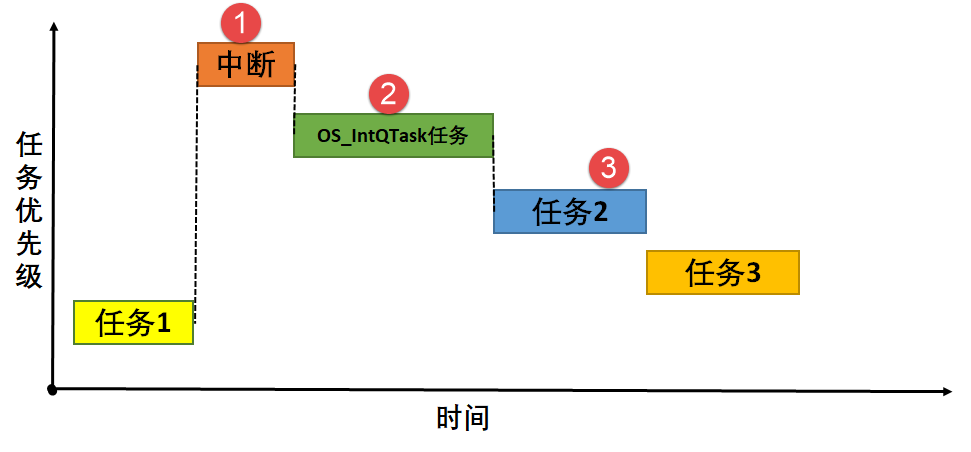

根据这张图详细解析 uC/OS-III 的 **中断延迟发布（Interrupt Deferred Post）** 的完整过程。

这张图非常精确地描绘了延迟发布模式的核心思想：**将中断内耗时且非紧急的内核服务调用（Post）推迟到一个专门的高优先级任务中执行，从而极大缩短中断关闭时间**。

整个过程可以分为以下四个阶段，与图中的标注和流程完全对应：

---

### 阶段一：任务运行 (对应图中 `任务1` 阶段)

*   **系统状态**：在中断发生前，CPU 正在执行一个低优先级的 **任务1**。
*   **此时调度器**的任务就绪表中，**任务1** 是优先级最高的就绪任务，因此它拥有CPU的执行权。

---

### 阶段二：中断发生与快速响应 (对应图中 `中断` 块)

1.  **中断请求**：一个硬件外设（如定时器、串口）发出了中断请求。
2.  **立即响应**：
    *   由于**中断的优先级**远高于当前运行的 **任务1**，CPU 立即响应此中断。
    *   CPU 自动保存当前任务（任务1）的上下文到其任务堆栈中。
3.  **执行ISR**：CPU 跳转到该中断对应的**中断服务程序（ISR）** 开始执行。**任务1** 被强制挂起。

**⚠️ 延迟发布模式下的ISR关键操作**：
*   ISR **不直接**调用像 `OSSemPost()` 这样的内核服务函数。
*   ISR 只做**最紧急、最必要**的工作，例如：
    *   从外设寄存器中读取数据。
    *   将数据和一些标识信息**快速存入**一个专门的**中断队列（Interrupt Queue）** 中。
*   这个“入队”操作非常快，且只需要**极短暂的关中断**来保护队列，之后立即重新打开中断。
*   ISR 执行完毕，**迅速退出**。

---

### 阶段三：延迟处理任务工作 (对应图中 `OS_IntQTask` 块)

1.  **任务唤醒**：在系统初始化时，uC/OS-III 会创建一个优先级为 **0**（最高优先级）的专用任务 `OS_IntQTask`。当ISR将数据放入中断队列后，会唤醒这个任务。
2.  **执行实际Post操作**：
    *   由于 `OS_IntQTask` 是最高优先级任务，一旦被唤醒，调度器立即让它运行。
    *   该任务从**中断队列**中取出ISR之前存入的数据和信息。
    *   **它代表中断**，去执行那些原本需要在ISR中执行的、耗时的内核服务调用，例如真正的 `OSSemPost()` 或 `OSQPost()`。
3.  **触发后续任务**：这个Post操作会使得一个等待该资源的**任务2** 从“挂起”状态变为“就绪”状态。

---

### 阶段四：任务调度与执行 (对应图中 `任务2` 和 `任务3`)

1.  **`OS_IntQTask` 执行完毕**：在完成队列中所有延迟Post操作后，`OS_IntQTask` 会挂起自己，再次等待被中断唤醒。
2.  **高优先级任务运行**：
    *   调度器现在需要调度当前就绪的最高优先级任务。由于 **任务2** 已经被 `OS_IntQTask` 发布的操作所唤醒，且其优先级高于 **任务1**，因此CPU开始执行 **任务2**。
    *   **任务2** 运行完毕后，优先级更低的 **任务3** 得到运行机会。
    *   最后，当所有高优先级任务都挂起或完成后，CPU才会回来继续执行最初被中断的、优先级最低的 **任务1**。

---

### 总结：延迟发布的精髓与优势

这张图完美对比了**直接发布**和**延迟发布**的区别：

| 特性 | **直接发布（Direct Post）** | **延迟发布（Deferred Post）** (图中所示) |
| :--- | :--- | :--- |
| **Post操作位置** | 在 **ISR内部** 直接执行 | 由 **专用任务 `OS_IntQTask`** 代为执行 |
| **关中断时间** | **很长**（整个Post操作期间都关中断） | **极短**（仅保护“入队”操作，入队后即开中断） |
| **优势** | 从中断到任务唤醒的延迟路径短 | **极大地提高了中断响应性**，允许其他高优先级中断及时被响应 |
| **劣势** | 长时间关中断危害系统实时性 | 从中断发生到任务2执行的总时间稍长（多了一次任务切换） |

**结论**：uC/OS-III 的延迟发布机制是一种 **“以空间换时间”** 的经典设计。它通过引入一个中间队列和一个专用任务，将中断服务程序**拆解**为一个**快速的“前台”响应**和一个**慢速的“后台”处理**，从而牺牲了微小的整体延迟，换来了系统中断响应能力的巨大提升，这对于需要处理大量高频中断的实时系统至关重要。