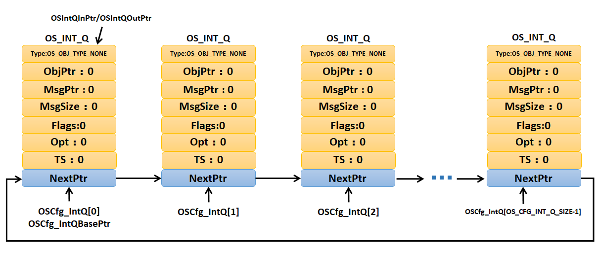

这张图非常清晰地展示了 **uC/OS-III 中断延迟发布（Deferred Post）机制**的核心数据结构——**中断队列**在**系统初始化完成后的初始状态**。

整个图描述的是一个**预先分配好的静态链表**，它将在运行时用于传递中断信息。下面我来分部分解析它的结构：

---

### 1. 核心管理指针 (位于图上方)

这两个指针是管理整个中断队列的“大脑”：

*   **`OSIntQInPtr` (中断队列输入指针)**：
    *   **作用**：指向**下一个空闲的、可用的**中断队列节点。当发生中断时，中断服务程序（ISR）会使用这个指针指向的节点来存储信息。
    *   **初始状态**：指向第一个节点 `OSCfg_IntQ[0]`。

*   **`OSIntQOutPtr` (中断队列输出指针)**：
    *   **作用**：指向**下一个待处理的**中断队列节点。专门处理中断的任务 `OS_IntQTask` 会从这个指针指向的节点中读取信息并执行操作。
    *   **初始状态**：同样指向第一个节点 `OSCfg_IntQ[0]`。

**初始时，两个指针指向同一个节点，表明队列是空的**，没有待处理的中断请求。

---

### 2. 中断队列节点 (`OS_INT_Q` 结构体)

图中的每一个方框都代表一个 `OS_INT_Q` 结构体，它是中断信息的载体。所有字段在初始状态下都被置零。

*   **`Type` (类型)**：
    *   **作用**：标识该节点存储的操作类型（例如，是发布信号量还是消息队列）。
    *   **初始值**：`OS_OBJ_TYPE_NONE` (无类型)，表示该节点是**空闲的**，未被使用。

*   **`ObjPtr` (对象指针)**：
    *   **作用**：指向目标内核对象（如某个信号量控制块的地址）。
    *   **初始值**：`0` (空指针)。

*   **`MsgPtr` (消息指针)** & **`MsgSize` (消息大小)**：
    *   **作用**：当操作是发送消息时，`MsgPtr` 指向消息内容，`MsgSize` 指明消息长度。
    *   **初始值**：`0`。

*   **`Flags` (标志)** & **`Opt` (选项)**：
    *   **作用**：提供操作的额外参数。`Flags` 用于事件标志组，`Opt` 指定操作选项（如FIFO或LIFO）。
    *   **初始值**：`0`。

*   **`TS` (时间戳)**：
    *   **作用**：记录中断发生的时间点，用于系统调试和性能分析。
    *   **初始值**：`0`。

*   **`NextPtr` (下一个指针)**：
    *   **作用**：这是构成**静态链表**的关键字段。它指向链表中的下一个 `OS_INT_Q` 节点。
    *   **指针关系**：如图所示，`OSCfg_IntQ[0]` 的 `NextPtr` 指向 `OSCfg_IntQ[1]`，`OSCfg_IntQ[1]` 的指向 `OSCfg_IntQ[2]`，以此类推，直到最后一个节点的 `NextPtr` 指向 `NULL`（空地址，图中未明确画出但可以推断）。这就形成了一个单向链表。

---

### 3. 队列的容器与基址

*   **`OSCfg_IntQ[]` (中断队列数组)**：
    *   **作用**：这是一个在编译时就分配好空间的**静态数组**，数组的元素就是一个个 `OS_INT_Q` 节点。数组的大小由配置文件中的 `OS_CFG_INT_Q_SIZE` 常数决定（图中最后一项的索引为 `OS_CFG_INT_Q_SIZE-1`）。
    *   **本质**：可以理解为操作系统开辟的一个“池子”，里面包含了固定数量的、可重用的中断信息存储单元。

*   **`OSCfg_IntQBasePtr` (中断队列基址指针)**：
    *   **作用**：永远指向这个数组的起始地址，即 `&OSCfg_IntQ[0]`。它是一个**锚点**，方便系统随时找到队列的开头。
    *   **初始状态**：指向 `OSCfg_IntQ[0]`。

---

### 总结：图的整体含义与工作流程联想

这张图展示了一个**静态初始化的中断队列链表**，它正处在“待命”状态。

*   **静态分配**：所有节点都是预先分配好的，没有动态内存申请，保证了实时系统的**确定性**（deterministic）。
*   **链表结构**：通过 `NextPtr` 连接成单向链表，`OSIntQInPtr` 和 `OSIntQOutPtr` 会沿着这个链表移动，管理节点的使用和释放。
*   **空队列**：因为所有节点的 `Type` 都是 `OS_OBJ_TYPE_NONE`，且输入输出指针重合，所以这是一个**空队列**。

**运行时的工作流程可以联想为：**
1.  **中断发生** -> ISR 使用 `OSIntQInPtr` 找到空闲节点，填入信息，并将 `Type` 改为非 `NONE`，然后移动 `OSIntQInPtr`。
2.  **任务处理** -> `OS_IntQTask` 任务检查 `OSIntQOutPtr` 指向的节点的 `Type`，如果不是 `NONE`，就执行操作，完成后将该节点 `Type` 重置为 `NONE`，并移动 `OSIntQOutPtr`。

这种设计极大地缩短了中断关闭时间，将耗时的操作推迟到任务中完成，是 uC/OS-III 实现高实时性的关键机制之一。

