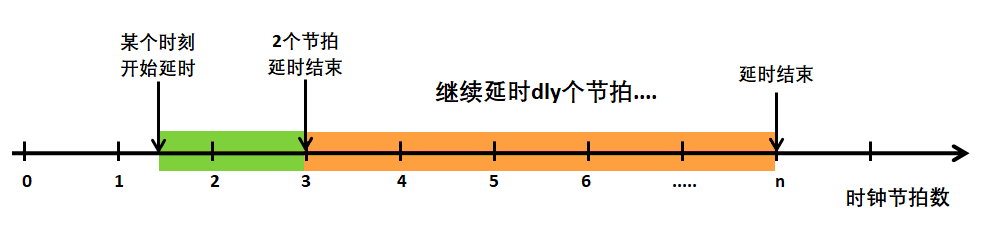

'OSStatTaskCPUUsageInit()'中，为什么需要延时两个节拍？

先延时两个节拍，为后面延时同步时钟节拍，增加准确性， 为什么要先延时两个节拍呢？因为是为了匹配后面一个延时的时间起点，当两个时钟节拍到达后，再继续延时dly个时钟节拍， 这样时间就比较精确，程序执行到这里的时候，我们并不知道时间过去了多少，所以此时的延时起点并不一定与系统的时钟节拍匹配，具体见下图。

注意，调用`OSStatTaskCPUUsageInit()`函数进行初始化的时候，一定要在创建用户任务之前，否则当系统有很多任务在调度的时候， 空闲任务就没法在某段时间内完成运算并且得到准确的`OSStatTaskCtrMax`，这样的CPU利用率计算是不准确的。