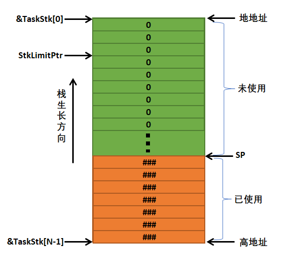
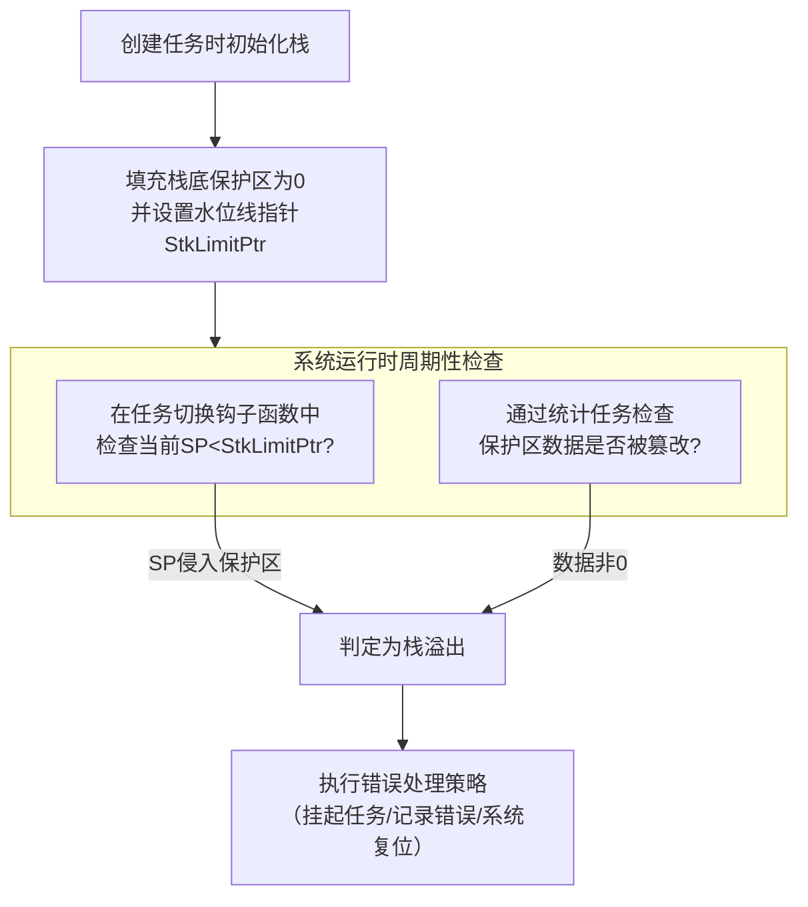

根据这张栈空间示意图，我们以STM32（采用ARM Cortex-M内核）为例，详细说明其栈溢出检测的实现机制。



STM32的栈采用**向下生长（Descending）** 方式，即栈顶指针（SP）向低地址方向移动。图片非常准确地描绘了这一点。

### 🔍 核心实现原理

uC/OS-III通过在栈底（低地址端）预留一段“保护区”并填充已知数据（通常是`0`），然后在任务调度时检查该区域数据是否被修改，从而判断是否发生了栈溢出。

其实现可以概括为以下三个关键步骤，这与您提供的图片完全对应：



---

### ⚙️ 一、实现细节（以STM32为例）

1.  **任务创建时的栈初始化 (`OSTaskCreate`)**
    *   当调用`OSTaskCreate()`函数创建任务时，系统会对你传入的栈数组（例如`TaskStk[1024]`）进行初始化。
    *   **填充已知值**：uC/OS-III会首先将整个栈空间填充一个特定的值，如`0xCCCCCCCC`。您图中填充的`0`是另一种常见方式，原理相同。
    *   **设置水位线指针 (`StkLimitPtr`)**：这是关键一步。系统会根据你在创建任务时指定的**栈限制值**（`stk_limit`）来计算并设置`StkLimitPtr`。例如，如果你的栈大小为100，限制值为10，那么：
        ```c
        StkLimitPtr = &TaskStk[0] + 10; // 指向栈底向上10个单位的位置
        ```
        这个指针标识了“保护区”的上边界。您图中`StkLimitPtr`所指的位置正是这个边界。

2.  **运行时检测的两种方式**
    uC/OS-III提供了两种在运行时进行检测的机制，通常结合使用：

    *   **方式一：任务切换时检查（依赖软件）**
        *   **时机**：在任务切换钩子函数`OSTaskSwHook()`中。
        *   **动作**：在切换到新任务之前，内核会检查**当前任务**的栈指针（`SP`）是否小于（即侵入）`StkLimitPtr`。
        *   **判断**：如果 `SP < StkLimitPtr`，说明栈使用已经突破了安全水位线，即将或已经破坏保护区，系统会触发栈溢出错误。

    *   **方式二：统计任务检查（依赖软件）**
        *   **时机**：如果使能了统计任务（`OS_CFG_STAT_TASK_EN`），它会周期性运行。
        *   **动作**：统计任务会检查每个任务栈中“保护区”的数据。
        *   **判断**：如果发现保护区中填充的`0`或`0xCC`被改写了（变成了其他值），说明栈曾经溢出到此区域，系统会触发栈溢出错误。这种方式能检测到“曾经发生过但当前已恢复”的溢出。

3.  **溢出处理**
    一旦检测到溢出，uC/OS-III会调用相应的错误处理函数，通常会：
    *   记录错误信息（任务ID、溢出地址等）。
    *   触发一个内核错误（`OS_ERROR`），根据配置，系统可能会自动挂起该任务或执行其他安全措施，防止系统崩溃。

---

### ⚠️ 二、在STM32上的注意事项

1.  **硬件无关性**：这种检测机制是纯软件实现的，**不依赖STM32的MPU（内存保护单元）**。因此，它可以在所有STM32型号上使用，但缺点是检测有延迟（只有在任务切换或统计任务运行时才能发现）。
2.  **性能开销**：填充栈和周期性检查会带来微小的CPU开销，在调试阶段必须开启，在量产产品中可根据可靠性要求决定是否关闭。
3.  **配置**：需在`os_cfg.h`中启用相关配置：
    ```c
    #define OS_CFG_STAT_TASK_EN        1u  // 启用统计任务
    #define OS_CFG_TASK_STK_CHK_EN     1u  // 启用任务栈检查
    ```
4.  **调试**：在调试器（如IAR、Keil）中，你可以直接查看任务的`StkLimitPtr`和当前`SP`的值，也可以观察栈内存，看保护区数据是否被破坏，这是定位溢出问题的有效方法。

### 💎 总结

对于STM32，uC/OS-III的栈溢出检测是一个**基于软件水印和边界指针**的轻量级且有效的方案。它通过在栈底预留并监控一个“保护区”，在任务调度过程中主动检查栈指针或保护区数据完整性，从而及时捕获溢出错误，极大增强了系统在复杂应用下的可靠性。您提供的图片完美地可视化了“保护区”、“水位线指针”和“栈增长方向”这一核心思想。