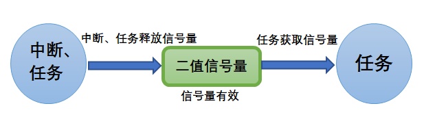

根据您提供的图片描述，二值型信号量（Binary Semaphore）的机制可通过图示清晰拆解为以下核心要点：

---

### 📍 **一、核心机制图解**
#### 🔄 **信号量状态流转**

- **初始状态**：信号量处于**无效状态（值为0）** → 相当于“锁闭”。
- **触发释放**：**中断或任务**调用 `OSSemPost()` → 信号量置为**有效（值为1）** → 相当于“钥匙已就位”。
- **任务获取**：**任务**调用 `OSSemPend()` → 获取信号量（值清零）→ 相当于“取走钥匙”。

> ✅ **二值本质**：信号量值非 **0（无效）** 即 **1（有效）**，无法累积释放次数。

---

### 🧩 **二、关键角色解析**
| **角色**          | **行为**                     | **典型场景**                          | **限制**                     |
|--------------------|------------------------------|---------------------------------------|------------------------------|
| **释放者** （左圆） | 触发 `OSSemPost()`           | - 中断收到数据 - 任务完成关键操作   | **中断中不可等待信号量**     |
| **信号量** （绿矩形） | 状态切换：0↔1              | 资源锁/事件标志                       | 同一时刻仅能被一个任务获取   |
| **获取者** （右圆） | 调用 `OSSemPend()`           | - 任务等待资源 - 任务等待事件触发   | 若信号量无效则阻塞/超时      |

---

### ⚡ **三、工作流程**
1. **同步场景（中断→任务）**  
   - **步骤1**：外部中断发生 → ISR调用 `OSSemPost()` → 信号量从 **0→1（有效）**。  
   - **步骤2**：任务通过 `OSSemPend()` 检测到信号量有效 → **获取信号量（1→0）** → 执行数据处理。  
   > 💡 如无数据时任务阻塞，信号量释放后立即唤醒任务。

2. **互斥场景（任务↔任务）**  
   - **步骤1**：任务A需访问共享资源 → 调用 `OSSemPend()` 获取信号量（1→0）。  
   - **步骤2**：任务B尝试访问时信号量=0 → **阻塞等待**。  
   - **步骤3**：任务A释放信号量（0→1）→ 任务B立即获取并访问资源。  
   > ⚠️ **严禁中断中获取信号量**：中断无法阻塞，若信号量无效将导致死锁！

---

### ⚠️ **四、注意陷阱**
1. **优先级反转风险**  
   - 低优先级任务占用信号量时，若高优先级任务等待，可能被中优先级任务抢占 → 通过 **互斥信号量（Mutex）** 解决。

2. **信号量泄漏**  
   - 忘记释放信号量（如异常分支未调用 `OSSemPost()`）→ 其他任务永久阻塞。

3. **中断专属规则**  
   - **中断仅能释放信号量**：因中断不可阻塞（图中“释放者”包含中断）。

---

### 💎 **总结**
您的图示完美诠释了二值信号量的**状态机本质**：  
1️⃣ 其值仅有 **0/1** 两种状态，像一把“钥匙”；  
2️⃣ **释放者（中断/任务）** 投递钥匙 → 使信号量有效；  
3️⃣ **获取者（任务）** 取走钥匙 → 使信号量失效；  
4️⃣ 释放与获取均为**原子操作**，保障多任务安全。  
这种机制是**事件通知型同步**（如中断触发任务）和**单资源互斥访问**的轻量化解决方案。